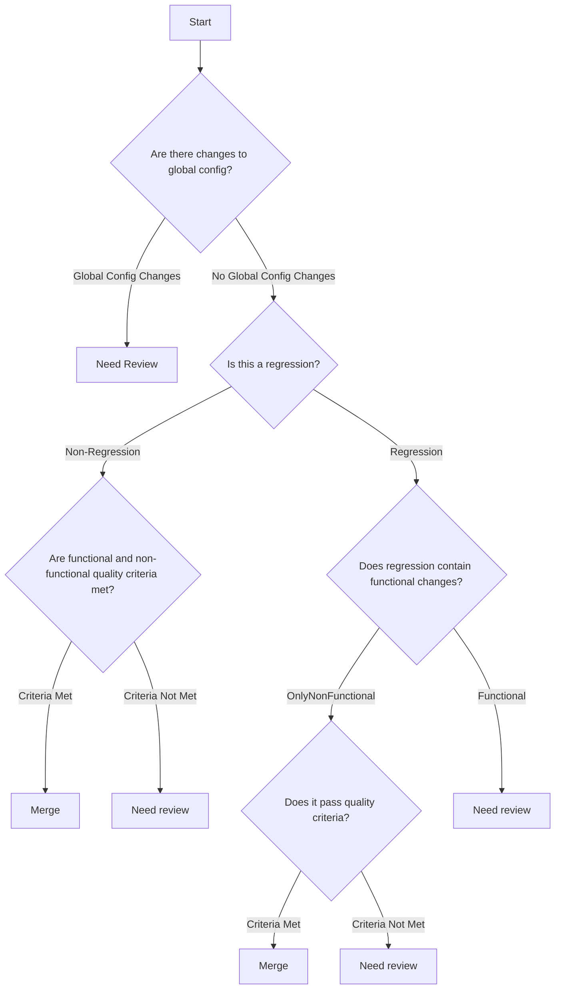

# Classify PR

Classifies a single PR against the decision tree and quality criteria defined below. This skill is self-contained — it does not depend on any repo-specific files (no `README.md`, `CONTEXT.md`, or ADR lookups). If a repo has its own sensitive-paths list or complexity-metric tooling, feel free to consult it as additional evidence, but the procedure below must work with none of that present.

## Invocation

`/classify-pr [<PR number or URL>]`

If no argument is given, resolve the PR from the current branch (`gh pr view --json number,url`). If none is found, ask the user which PR to classify.

## Procedure

### 1. Gather the PR

- `gh pr view <n> --json number,title,body,url,files,additions,deletions,baseRefName,headRefName`
- `gh pr diff <n>` for the full diff (per-file hunks, not just a stat summary — categorization and Regression detection both require line-level detail)
- Read the title/body/linked issues for narrative context only (do **not** use stated intent to decide Regression — see step 3).

### 2. Categorize every changed file

For each file in the diff, assign exactly one category:

- **Documentation**: the file is a prose file (`*.md`, `docs/**`), OR every changed line in the file is a docstring line (JSDoc `/** */` in `.ts`, XML `///` doc comments in `.cs`, treating this as a seed list — extend to other doc-comment styles as needed). Any non-docstring line changed in the file disqualifies it from Documentation.
- **Global Config Change**: the file's effect alters behavior across multiple services/environments without a code change of its own — shared env defaults, feature-flag defaults, CI workflow files, infra-as-code, dependency/lockfile bumps. Per-module local config does not count.
- **Production Code**: anything left over that ships to and executes in the deployed runtime artifact (test code counts as Production Code here for tree-traversal purposes — it still passes through the same Regression/criteria checks).

A file can only be Global Config Change in addition to Production Code; Documentation is mutually exclusive with everything else.

### 3. Walk the decision tree

- A Global Config Change anywhere in the diff → **Need review**.
- Otherwise, determine **Regression**: does the diff modify or delete at least one line in a file that existed before this PR? (Any such line counts, regardless of test coverage — do not use PR title/intent for this call.) Purely new files / purely additive changes → **Non-Regression**.
- If Regression: does it contain functional changes (changes to business logic/behavior), or is it only non-functional (e.g. formatting, comments, perf tuning that doesn't alter business rules)? Functional → **Need review**. Only-non-functional → continue to the criteria check.
- If Non-Regression, or Regression-only-non-functional: continue to the criteria check (step 4).

### 4. Score Quality Criteria

Always compute this step when step 3 reached a criteria-check node (D or F) — the score decides Merge vs. Need review, and (together with step 5) Medium vs. High. Score each criterion 0 (no breach) to 3 (severe breach), by your own judgment reading the diff and any tests:

**Non-Functional Quality criteria:**

1. Reasonable performance impact
2. Maintainability and readability of the code (use a complexity-metric score as supporting evidence if one is available; otherwise judge qualitatively)

**Functional Quality criteria:**

3. Business rules and decisions are documented in /docs/features
4. Business rules are supported by automated tests
5. Does not contain a critical path, per the list below (score 3 if it does)

All five are equally weighted — no criterion is inherently more severe than another; only the degree of breach matters. Any criterion scoring 3, or any unresolved breach at all, means criteria are **Not Met** for that tree node.

**Critical paths:**

- New feature critical paths:
  - Security sensitive, i.e. storage of new data fields which include personal information
- Regression critical paths:
  - Destructive data operations
  - Security sensitive, i.e. storage of new data fields which include personal information

### 5. Determine Criticality

- Step 3 said **Merge** → **Low**.
- Step 3 said **Need review** → **High** if it touches a critical path (criterion 5 scored 3) or any other criterion scored 3, otherwise **Medium**. A Need review reached directly via Global Config Change (node B1) or via a functional regression (node V) with no critical-path involvement is **Medium** unless a critical path is also present.

Low is never assigned when step 3 said Need review, regardless of scores: the tree's structural verdict is the authority on mergeability; scoring only grades severity among Need-review outcomes.

### 6. Report the result

- Print to stdout: the tree path taken, each file's category, the per-criterion scores with one-line justifications, and the final Criticality.
- Post the same reasoning as a PR comment: `gh pr comment <n> --body "..."`, prefixed with `> *This classification was generated by AI.*`
- Apply the label: remove any existing `criticality:low` / `criticality:medium` / `criticality:high` label first (`gh pr edit <n> --remove-label`), then add the new one (`gh pr edit <n> --add-label "criticality:<low|medium|high>"`). Create the label first with `gh label create` if it doesn't exist yet in the repo.
- Exit with a status code matching the Criticality: `0` for Low, `1` for Medium, `2` for High.
