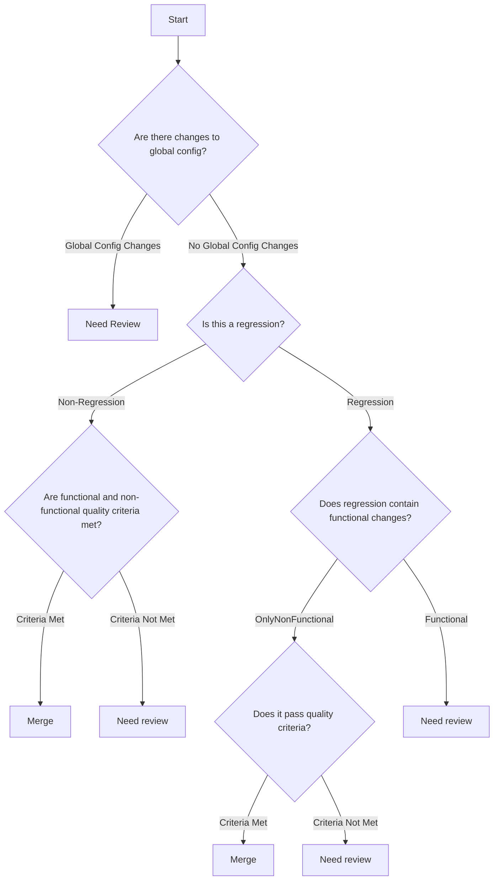

# Improve PR Quality

Pairs with `classify-pr` but is fully self-contained — it does not read or depend on that skill being installed, so either skill can be deployed on its own. Where a plain classification only scores and labels a PR, this skill asks the next question: of everything driving a Need-review verdict, what part is actually fixable in this PR, and what part is inherent to the change and must stay Need review? The goal is not fewer Need-review labels — it's fewer PRs that *need* to carry one.

## Invocation

`/improve-pr-quality [<PR number or URL>]`

If no argument is given, resolve the PR from the current branch (`gh pr view --json number,url`). If none is found, ask the user which PR to assess.

## Procedure

### 1. Gather and classify the PR

- `gh pr view <n> --json number,title,body,url,files,additions,deletions,baseRefName,headRefName`
- `gh pr diff <n>` for the full diff (line-level detail, not just a stat summary).

Categorize every changed file into exactly one of:

- **Documentation**: a prose file (`*.md`, `docs/**`), or every changed line in the file is a docstring line. Any non-docstring line changed disqualifies it.
- **Global Config Change**: alters behavior across multiple services/environments without a code change of its own — shared env defaults, feature-flag defaults, CI workflow files, infra-as-code, dependency/lockfile bumps. Per-module local config does not count.
- **Production Code**: everything else that ships to and executes in the deployed runtime artifact (test code counts as Production Code).

Then walk this tree:

- A Global Config Change anywhere in the diff → **Need review**.
- Otherwise determine **Regression**: does the diff modify or delete at least one line in a file that existed before this PR (regardless of test coverage or stated intent)? Purely new/additive files → **Non-Regression**.
- If Regression: does it contain functional changes (business logic/behavior), or is it only non-functional (formatting, comments, perf tuning that doesn't alter business rules)? Functional → **Need review**. Only-non-functional → continue to the criteria check.
- If Non-Regression, or Regression-only-non-functional → continue to the criteria check.

At a criteria-check node (D or F), score each criterion 0 (no breach) to 3 (severe breach):

**Non-Functional:**

1. Reasonable performance impact.
2. Maintainability and readability of the code.

**Functional:**

3. Business rules and decisions are documented in `/docs/features`.
4. Business rules are supported by automated tests.
5. Does not contain a critical path (score 3 if it does): new-feature critical paths are security-sensitive ones (e.g. storage of new personal-information fields); regression critical paths are destructive data operations or the same security-sensitive case.

All five are equally weighted. **Any criterion scoring 3, or any unresolved breach at all (score 1 or higher), means criteria are Not Met** for that node.

Determine Criticality: tree said Merge → **Low**. Tree said Need review → **High** if a critical path is involved (criterion 5 scored 3) or any criterion scored 3, otherwise **Medium**.

If the result is **Merge** (Low): report that the PR is already at the minimum — no fix needed. Stop here.

### 2. Identify every driver of the Need-review verdict

A **driver** is anything that, if removed, would flip the tree outcome or lower the score. List every one that applies:

- Global Config Change present (tree node B1).
- Regression contains functional changes (tree node V).
- Any quality criterion scored **1 or higher** — per the rubric, any unresolved breach at all (not just a 3) keeps criteria Not Met, so every nonzero criterion is a driver.

For each driver, note which tree node or criterion it maps to and its score.

### 3. Classify each driver as Addressable or Structural

- **Addressable**: a concrete, honest change to the PR's contents would remove or reduce the breach without changing what the PR is actually shipping. Examples:
  - Criterion 1 (performance): optimize the implementation.
  - Criterion 2 (maintainability): refactor for readability, simplify, or split an oversized change.
  - Criterion 3 (docs): add the missing entry to `/docs/features`.
  - Criterion 4 (tests): add automated test coverage for the business rule.
  - Global Config Change mixed with unrelated code changes: split the config-only change into its own PR so the risky part is isolated and the rest can proceed on its own merits.
- **Structural**: the breach is inherent to what the change does, and no edit removes it honestly. Examples: criterion 5 (touches a listed critical path), a regression with genuine functional changes, or a global config change that is the entire point of the PR.

Never propose a "fix" that hides risk instead of reducing it: do not suggest removing or weakening tests, deleting documentation of a business rule, relabeling a functional change as non-functional, or splitting a PR merely to move a critical-path change out of view of this review. If a driver can only be resolved that way, it is Structural — say so plainly and leave it as a genuine Need review.

### 4. Propose fixes and project the outcome

For each Addressable driver, give a specific, actionable change referencing exact files/lines from the diff (not a generic suggestion). Then re-walk the tree and rescore as if every proposed Addressable fix were made, to get a **projected verdict and Criticality**.

If any Structural driver remains, the projected verdict stays Need review regardless of the Addressable fixes — state this clearly so the projection isn't mistaken for a way to engineer around real risk.

### 5. Report, and offer — don't assume — implementation

Print:

- Current tree path, per-criterion scores, and Criticality (as produced in step 1).
- A driver-by-driver breakdown: node/criterion, score, Addressable or Structural, and the concrete fix if Addressable.
- The projected verdict and Criticality if all Addressable fixes are applied.
- If Structural drivers remain, a one-line statement that Need review is warranted and why.

Ask the user before doing either of the following — do not do them unprompted:

- Implementing the proposed fixes (adding the tests/docs, refactoring, splitting the PR) on the PR's branch.
- Posting the assessment as a PR comment (`gh pr comment <n> --body "..."`, prefixed with `> *This assessment was generated by AI.*`) or pushing any implemented fixes.

Do not change the PR's criticality label yourself — this skill only assesses and recommends. Re-score (with this skill, `classify-pr`, or equivalent) after fixes are pushed so any label reflects the actual, re-scored diff.
